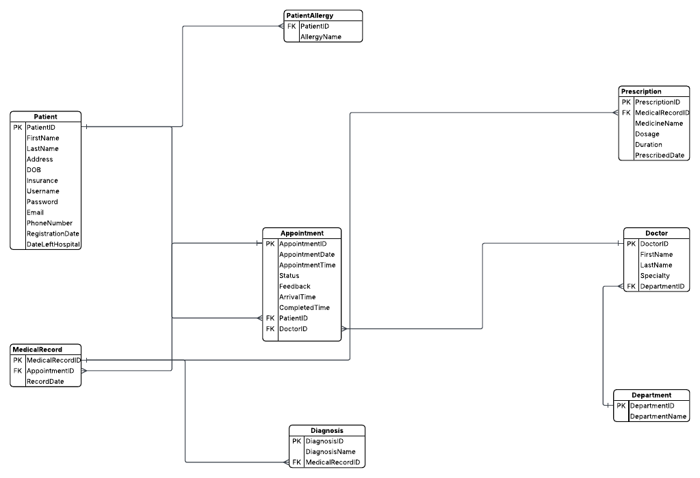

# Hospital Database Management System

This project demonstrates the design and implementation of a Hospital Database Management System using Microsoft SQL Server and T-SQL.

The database was designed and normalised to Third Normal Form (3NF) and includes tables, constraints, stored procedures, user-defined functions, views and triggers to support hospital operations.

## Features

- Patient Management
- Doctor Management
- Department Management
- Appointment Scheduling
- Medical Records
- Diagnoses
- Prescriptions
- Patient Allergies
- Stored Procedures
- User Defined Functions
- Views
- Triggers

## Entity Relationship Diagram

## Technologies

- Microsoft SQL Server
- SQL Server Management Studio (SSMS)
- T-SQL

## Project Structure

- SQL Scripts
- ERD
- Project Report
- Database Backup
